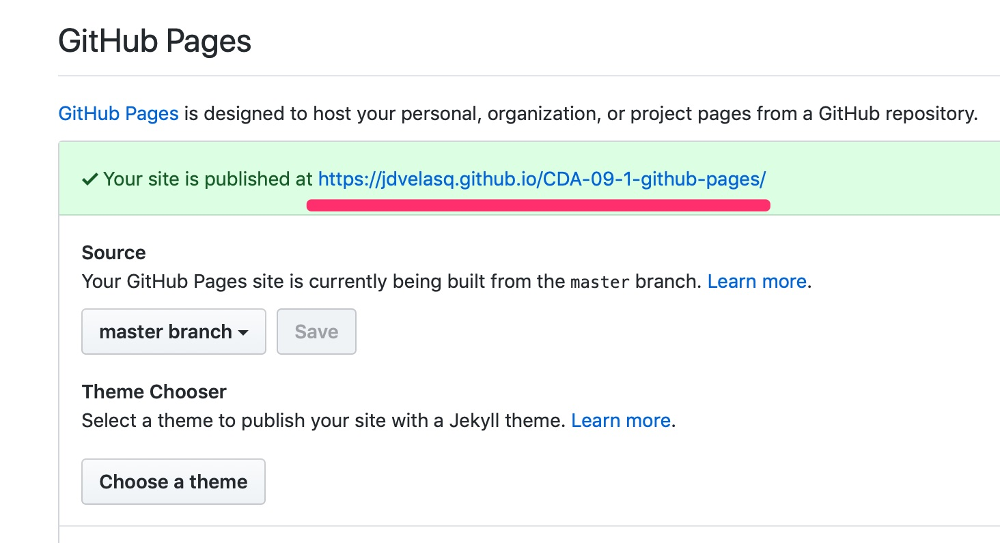
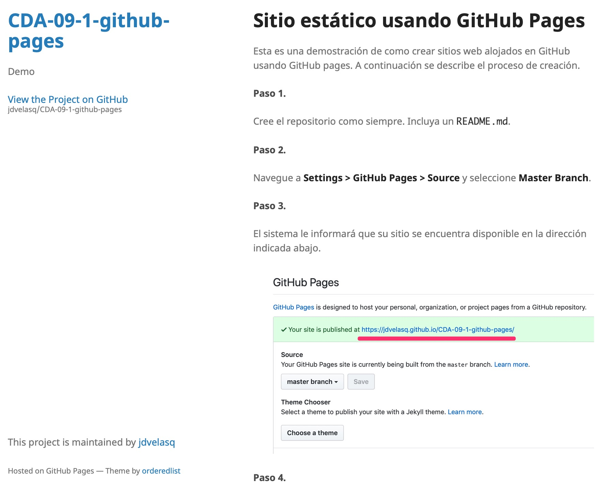

# Sitio estático usando GitHub Pages

Esta es una demostración de como crear sitios web alojados en GitHub usando GitHub pages. A continuación se describe el proceso de creación. 

#### Paso 1.

Cree el repositorio como siempre. Incluya un `README.md`. 

#### Paso 2. 

Navegue a **Settings > GitHub Pages > Source** y seleccione  **Master Branch**.

#### Paso 3.

El sistema le informará que su sitio se encuentra disponible en la dirección indicada abajo.

#### Paso 4.

Navegue a **Settings > GitHub Pages > Theme Chooser** y Seleccione **Minimal**. Espere unos segundos y vuela a visualizar su sitio Web.

#### Paso 5.

Agregue archivos al repositorio, tal como notebooks de Jupyter o imágenes. Agregue hipervínculos a este documento. En este ejemplo se agregó el archivo `notebook.ipynb` y el siguiente vínculo:

> Haga click [aquí](notebook.ipynb) para **Descargar** el notebook.

> Haga click [aquí](http://nbviewer.jupyter.org/github/jdvelasq/CDA-09-1-github-pages/blob/master/notebook.ipynb) para **Ver** el notebook en nbviewer.

#### Paso 6

Convierta el libro a html. En la consola de comandos digite:

      jupyter nbconvert --to html notebook.ipynb
      
Luego, agregue el hipervínculo a la página del libro.

> Haga click [aquí](/notebook.html) para **Ver** el notebook.

